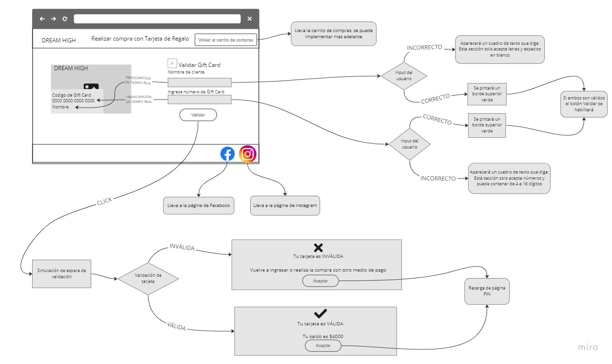

# Validar Gift Card

Este proyecto es una interfaz para validar una Gift Card de una empresa llamada **DREAM HIGH** la cual tiene como objetivo relizar ventas por internet.

Esta sección solamente está enfocada para los usuarios que quieren hacer la compra a travez de su Gift Card y necesitan colocar sus datos y validar la tarjeta.

Esta interfaz permitirá que al ingresar los datos se muestre en tiempo real el llenado de datos en una tarjeta visual, además permitirá ocultar todos los dígitos del número de la tarjeta a excepción de los últimos cuatro dígitos y para la validación de la tarjeta se uso el **_algoritmo de Luhn_**.

---

## Contenido

- [Prototipo y Diagrama de flujo](#prototipo-y-diagrama-de-flujo)

- [Objetivos Principales](#objetivos-principales)

- [Diseño y Funcionalidad](#diseño-y-funcionalidad)

- [Objetivos de aprendizaje](#objetivos-de-aprendizaje)

- [Resultado final]()

---

## Prototipo y Diagrama de flujo

---

## Objetivos Principales

### 1. Validación de la tarjeta

En esta interfaz se ha usado el [algoritmo de Luhn](https://es.wikipedia.org/wiki/Algoritmo_de_Luhn), también llamado algoritmo de módulo 10, es un método de suma de verificación,
se utiliza para validar números de identificación; tales como el IMEI de los
celulares, tarjetas de crédito, etc.

Este algoritmo es simple. Obtenemos la reversa del número a verificar (que
solamente contiene dígitos [0-9]); a todos los números que ocupan una posición
par se les debe multiplicar por dos, si este número es mayor o igual a 10,
debemos sumar los dígitos del resultado; el número a verificar será válido si
la suma de sus dígitos finales es un múltiplo de 10.

Por lo tanto con este algoritmo veremos si el número de la Gift Card es válida o no.

### 2. Enmascaramiento de Gift Card

En esta interfaz se muestra en tiempo real una tarjeta visual en la cual por razones de privacidad se ha pensado en el enmascaramiento de dígitos del número de la tarjeta, dejando los últimos cuatro dígitos intactos, por ejemplo:

| Código de Gift card | Enmascaramiento     |
| ------------------- | ------------------- |
| 9876 5456 7123 5678 | #### #### #### 5678 |
| 2934 5678 8976 1234 | #### #### #### 1234 |

---

## Diseño y Funcionalidad

El diseño de está interfaz fue pensada para que el usuario navegue de manera intuitiva y la experiencia con la interfaz sea agradable, ya que, se incorporó animaciones sutiles y personalizadas de acuerdo a la empresa en cuestíon.

Este proyecto está pensado para que el usuario interactúe de manera fácil y segura con el llenado de datos y validación de tarjeta, ya que se pensó en los distintos problemas que puede generar el llenado de datos es por eso que se centró en mejorar la funcionalidad de la interfaz de la siguiente manera:

La solución a estos problemas se dará de manera visual ya que aparecerán mensajes de error y borde rojo, si llena de una manera errónea, por otra parte, si lo ingresado es válido tendra un borde verde.

Además el botón para validar si la tarjeta es válida o no, no se activará hasta que todos los campos sean válidos .

Si el botón se habilita, una vez presionado hará una simulación de espera de validación y luego mostrará una ventana modal la cual nos dirá si mi tarjeta es válida o no, si es válida mostrará tambien una simulacion de saldo en la tarjeta y si no dirá que vuelva a ingresar o que realice la compra con otro método de pago.

Finalmente para cualquiera que sea el caso de validez el usuario cerrará la ventana modal la cual tiene solo un botón de aceptar y con esto queda concluida la interacción que pueda tener el usuario con nuestra interfaz.

---

## Objetivos de aprendizaje

En este proyecto se ha usado los fundamentos de JavaScript, incluyendo conceptos como variables, condicionales, y funciones, así como eventos y manipulación del DOM, fundamentos de HTML y CSS.

### HTML

- [x] Uso de HTML semántico

### CSS

- [x] Uso de selectores de CSS

- [x] Modelo de caja (box model): borde, margen, padding

### Web APIs

- [x] Uso de selectores del DOM

- [x] Manejo de eventos del DOM (listeners, propagación, delegación)

- [x] Manipulación dinámica del DOM

### JavaScript

- [x] Tipos de datos primitivos

- [x] Strings (cadenas de caracteres)

- [x] Variables (declaración, asignación, ámbito)

- [x] Uso de condicionales (if-else, switch, operador ternario, lógica booleana)

- [x] Uso de bucles/ciclos (while, for, for..of)

- [x] Funciones (params, args, return)

- [x] Pruebas unitarias (unit tests)

- [x] Módulos de ECMAScript (ES Modules)

- [x] Uso de linter (ESLINT)

- [x] Uso de identificadores descriptivos (Nomenclatura y Semántica)

### Control de Versiones (Git y GitHub)

- [x] Git: Instalación y configuración

- [x] Git: Control de versiones con git (init, clone, add, commit, status, push, pull, remote)

- [ ] GitHub: Creación de cuenta y repos, configuración de llaves SSH

- [x] GitHub: Despliegue con GitHub Pages

### Centrado en el usuario

- [x] Diseñar y desarrollar un producto o servicio poniendo a las usuarias en el centro

### Diseño de producto

- [x] Crear prototipos de alta fidelidad que incluyan interacciones

- [x] Seguir los principios básicos de diseño visual

---

## Resultado Final

